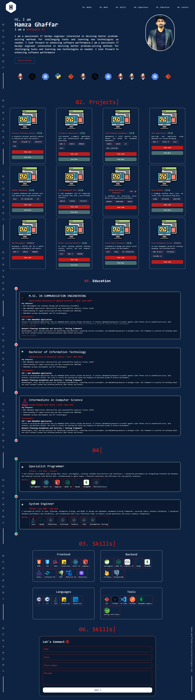

# React Portfolio Website

This project is a React.js portfolio website designed to showcase my skills, projects, and contact information. It is still under development and open for contributions. The application will be built, tested, and deployed using Docker containers and automated through a Jenkins CI/CD pipeline.

 //

## Secure Access to My Projects via ZeroTier

I have set up a private ZeroTier network for secure access to my projects.

### Access Steps:

1. **Install ZeroTier:** Download and install the ZeroTier client from the [official ZeroTier website](https://www.zerotier.com/download/).
2. **Join the Network:** Open the ZeroTier client and enter the network ID `ebe7fbd4450b71ef` to connect to my private VPN.
3. **Explore Applications:** Once connected, navigate to my applications hosted on designated ports to view their functionalities in real-time.

This setup ensures secure access to my work without exposing sensitive data to the public.

## Technologies Used

- **React.js:** JavaScript library for building user interfaces.
- **Tailwind CSS:** Utility-first CSS framework for styling.
- **Mantine:** A React component library for building applications.
- **Tabler Icons:** A set of customizable icons for web applications.
- **Git:** Version control system.
- **Docker:** Tool to containerize applications.
- **Jenkins:** Automation server for CI/CD.

## Step 1: Local Development Setup

### 1.1 Install Node.js and npm

Before starting, install Node.js and npm. They are required to run and build the React app.

- Download from the [Node.js official site](https://nodejs.org/).
- Verify installation by running:
  ```bash
  node -v
  npm -v
  ```

git clone https://github.com/Hamza-Ghaffar/portfoliowebsite-v1.git
cd portfoliowebsite-v1
npm install
npm start

# Use the official Node.js image

FROM node:14

# Set the working directory

WORKDIR /usr/src/app

# Copy package.json and package-lock.json

COPY package\*.json ./

# Install dependencies

RUN npm install

# Copy the rest of the application code

COPY . .

# Build the app

RUN npm run build

# Expose the port

EXPOSE 3000

# Start the application

CMD ["npm", "start"]

docker build -t react-portfolio .
docker run -p 3000:3000 react-portfolio
docker run -d -p 8080:8080 -p 50000:50000 jenkins/jenkins:lts

#!/bin/bash

# Define the app and container names

APP_NAME="my-react-app-container"
IMAGE_NAME="react-portfolio"

# Navigate to the app directory

cd "$WORKSPACE" # Jenkins workspace directory

# Check if the container is already running and remove it if it exists

if [ "$(docker ps -aq -f name=$APP_NAME)" ]; then
echo "Stopping and removing existing container: $APP_NAME"
docker rm -f $APP_NAME # Remove the existing container
fi

# Remove old images if they exist

if [ "$(docker images -q $IMAGE_NAME)" ]; then
echo "Removing old image: $IMAGE_NAME"
docker rmi -f $IMAGE_NAME # Remove the old image
fi

# Build the Docker image

echo "Building the Docker image: $IMAGE_NAME"
docker build -t $IMAGE_NAME .

# Run the Docker container

echo "Running the Docker container: $APP_NAME"
docker run -d -p 3000:3000 --name $APP_NAME $IMAGE_NAME
